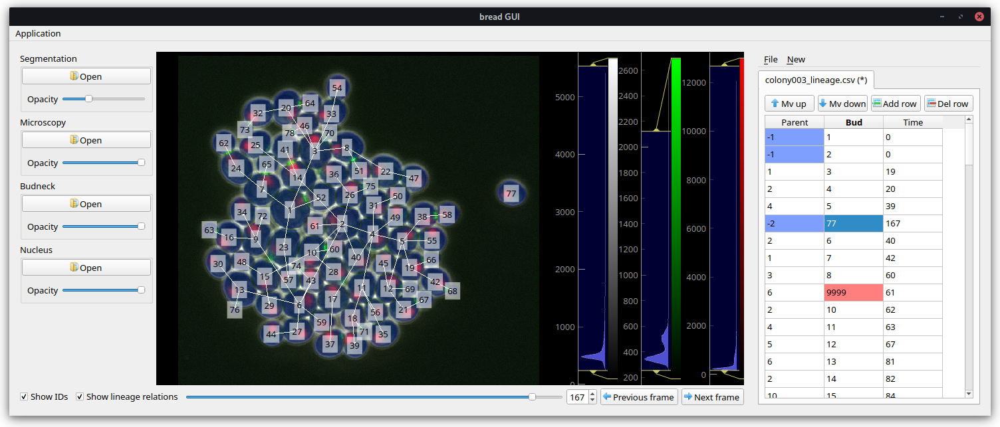
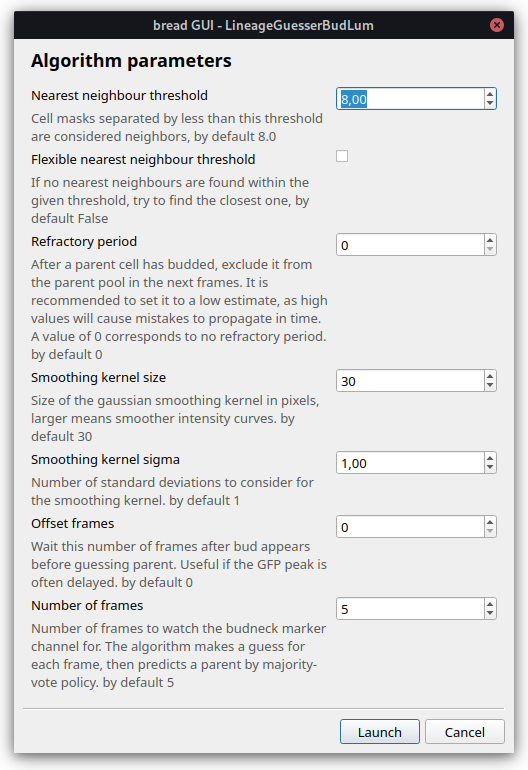

# ``bread`` -- determining lineage of budding yeast cells

## Installation

Recommended : create a virtual environment :

```sh
conda create -n lpbs_bread python=3.7
conda activate lpbs_bread
python -m pip install pip --upgrade
```

Direct installation (requires `git`)

```sh
# core+data+gui dependencies
# python -m pip install "bread[data,gui] @ git+https://github.com/ninivert/bread.git"
```

For development :

```sh
# Install the package in development mode (installs dependencies and creates symlink)
git clone https://github.com/ninivert/bread
# alternatively, download and extract the zip of the repository
cd bread
pip install -e .
```

## Graphical user interface

Launch the GUI using ``python -m bread.gui``.

See (a video demo)[https://www.youtube.com/watch?v=hBU8o04ybDg>]






## Command-line interface

Launch the CLI using ``python -m bread.cli --help``.

## Raw data

The testing data can be downloaded at https://drive.google.com/file/d/1XcXTDPyDiBBlLeQpNFmugn3O6xVFfleU/view?usp=sharing.